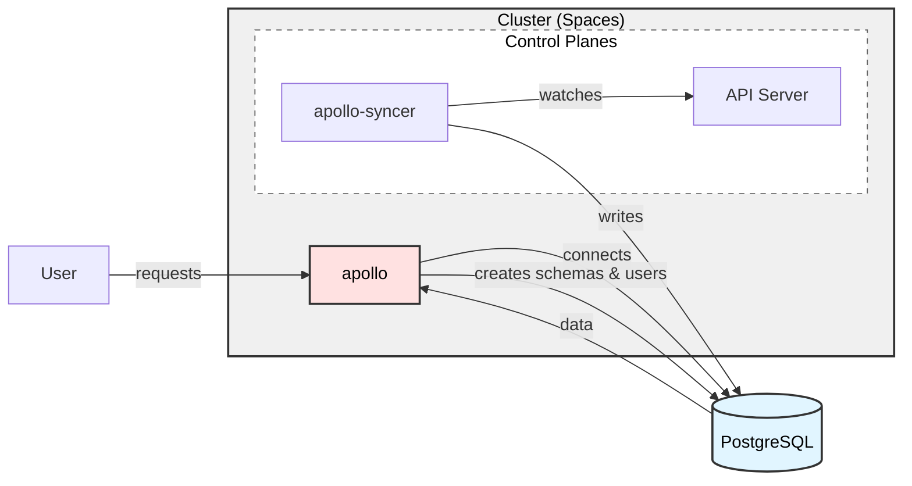

<!-- vale write-good.TooWordy = NO -->
<!-- ignore "aggregate" -->

:::important

This feature is in preview. The Query API is available in the Cloud Space offering in `v1.6` and enabled by default.

This is a requirement to be able to connect a Space since `v1.8.0`, and is off by default, see below to enable it.

:::

Upbound's Query API allows users to inspect objects and resources within their control planes. The read-only `up alpha query` and `up alpha get` CLI commands allow you to gather information on your control planes in a fast and efficient package. These commands follow the [`kubectl` conventions][kubectl-conventions] for filtering, sorting, and retrieving information from your Space.

Query API requires a PostgreSQL database to store the data. You can use the default PostgreSQL instance provided by Upbound or bring your own PostgreSQL instance.

## Managed setup

:::tip
If you don't have specific requirements for your setup, Upbound recommends following this approach.
:::

To enable this feature, set `features.alpha.apollo.enabled=true` and `features.apollo.storage.postgres.create=true` when installing Spaces.

However, you need to install CloudNativePG (`CNPG`) to provide the PostgreSQL instance. You can let the `up` CLI do this for you, or install it manually.

For more customization, see the [Helm chart reference][helm-chart-reference]. You can modify the number
of PostgreSQL instances, pooling instances, storage size, and more.

If you have specific requirements not addressed in the Helm chart, see below for more information on how to bring your own [PostgreSQL setup][postgresql-setup].

### Using the up CLI

Before you begin, make sure you have the most recent version of the [`up` CLI installed][up-cli-installed].

To enable this feature, set `features.alpha.apollo.enabled=true` and `features.apollo.storage.postgres.create=true` when installing Spaces:

```bash
up space init --token-file="${SPACES_TOKEN_PATH}" "v${SPACES_VERSION}" \
  ...
  --set "features.alpha.apollo.enabled=true" \
  --set "features.apollo.storage.postgres.create=true"
```

`up space init` and `up space upgrade` install CloudNativePG automatically, if needed.

### Helm chart

If you are installing the Helm chart in some other way, you can manually install CloudNativePG in one of the [supported ways][supported-ways], for example:

```shell
kubectl apply --server-side -f \
             https://github.com/cloudnative-pg/cloudnative-pg/releases/download/v1.24.1/cnpg-1.24.1.yaml
kubectl rollout status -n cnpg-system deployment cnpg-controller-manager -w --timeout 120s
```

Next, install the Spaces Helm chart with the necessary values, for example:

```shell
helm -n upbound-system upgrade --install spaces \
  oci://xpkg.upbound.io/spaces-artifacts/spaces \
  --version "${SPACES_VERSION}" \
  ...
  --set "features.alpha.apollo.enabled=true" \
  --set "features.apollo.storage.postgres.create=true" \
  --wait
```
<!-- vale Google.Headings = NO -->
## Self-hosted PostgreSQL configuration
<!-- vale Google.Headings = YES -->

If your workflow requires more customization, you can provide your own
PostgreSQL instance and configure credentials manually.

Using your own PostgreSQL instance requires careful architecture consideration.
Review the architecture and requirements guidelines.

### Architecture

The Query API architecture uses three components, other than a PostgreSQL database:
* **Apollo Syncers**: Watching `ETCD` for changes and syncing them to PostgreSQL. One, or more, per control plane.
* **Apollo Server**: Serving the Query API out of the data in PostgreSQL. One, or more, per Space.

The default setup also uses the `PgBouncer` connection pooler to manage connections from the syncers.



Each component needs to connect to the PostgreSQL database.

In the event of database issues, you can provide a new database and the syncers
automatically repopulate the data.

### Requirements

* A PostgreSQL 16 instance or cluster.
* A database, for example named `upbound`.
* **Optional**: A dedicated user for the Apollo Syncers, otherwise the Spaces Controller generates a dedicated set of credentials per syncer with the necessary permissions, for example named `syncer`.
* A dedicated **superuser or admin account** for the Apollo Server.
* **Optional**: A connection pooler, like PgBouncer, to manage connections from the Apollo Syncers. If you didn't provide the optional users, you might have to configure the pooler to allow users to connect using the same credentials as PostgreSQL.
* **Optional**: A read replica for the Apollo Syncers to connect to, to reduce load on the primary database, this might cause a slight delay in the data being available through the Query API.

Below you can find examples of setups to get you started, you can mix and match the examples to suit your needs.

### In-cluster setup

:::tip

If you don't have strong opinions on your setup, but still want full control on
the resources created for some unsupported customizations, Upbound recommends
the in-cluster setup.

:::

For more customization than the managed setup, you can use CloudNativePG for
PostgreSQL in the same cluster.

For in-cluster setup, manually deploy the operator in one of the [supported ways][supported-ways-1], for example:

```shell
kubectl apply --server-side -f \
             https://github.com/cloudnative-pg/cloudnative-pg/releases/download/v1.24.1/cnpg-1.24.1.yaml
kubectl rollout status -n cnpg-system deployment cnpg-controller-manager -w --timeout 120s
```

Then create a `Cluster` and `Pooler` in the `upbound-system` namespace, for example:

```shell
kubectl create ns upbound-system

kubectl apply -f - <<EOF
---
apiVersion: postgresql.cnpg.io/v1
kind: Cluster
metadata:
  name: spaces-apollo-pg
  namespace: upbound-system
spec:
  instances: 2
  imageName: ghcr.io/cloudnative-pg/postgresql:16
  bootstrap:
    initdb:
      database: upbound
      owner: apollo
      postInitApplicationSQL:
      - ALTER ROLE "apollo" CREATEROLE;
  certificates:
    serverAltDNSNames:
      - spaces-apollo-pg-pooler
      - spaces-apollo-pg-pooler.upbound-system
      - spaces-apollo-pg-pooler.upbound-system.svc
      - spaces-apollo-pg-pooler.upbound-system.svc.cluster.local
  storage:
    size: 10Gi
---
apiVersion: postgresql.cnpg.io/v1
kind: Pooler
metadata:
  name: spaces-apollo-pg-pooler
  namespace: upbound-system
spec:
  cluster:
    name: spaces-apollo-pg
  pgbouncer:
    poolMode: transaction
    parameters:
      max_client_conn: "1000"
      default_pool_size: "10"
      max_prepared_statements: "1000"
  instances: 2
  type: rw
---
apiVersion: networking.k8s.io/v1
kind: NetworkPolicy
metadata:
  name: allow-syncer-ingress-to-apollo-pg
  namespace: upbound-system
spec:
  ingress:
    - from:
        - podSelector:
            matchLabels:
              app: mxp-apollo-syncer
      ports:
        - port: 5432
          protocol: TCP
  podSelector:
    matchLabels:
      cluster: spaces-apollo-pg
  policyTypes:
    - Ingress
EOF
```

Adjust the `Cluster` and `Pooler` resources to your needs, for example by changing the `spec.storage.size` or `spec.imageName`.

CloudNativePG takes care of setting up the necessary Secrets.

Next, configure Spaces to use the CloudNativePG secrets:

```shell
helm upgrade --install ... \
  --set "features.alpha.apollo.enabled=true" \
  --set "features.apollo.storage.postgres.create=false" \
  --set "features.apollo.storage.postgres.connection.apollo.credentials.user=apollo" \
  --set "features.apollo.storage.postgres.connection.url=spaces-apollo-pg-rw:5432" \
  --set "features.apollo.storage.postgres.connection.credentials.secret.name=spaces-apollo-pg-app" \
  --set "features.apollo.storage.postgres.connection.credentials.format=basicauth" \
  --set "features.apollo.storage.postgres.connection.ca.name=spaces-apollo-pg-ca" \
  --set "features.apollo.storage.postgres.connection.syncer.url=spaces-apollo-pg-pooler.upbound-system.svc:5432"
  --set "features.apollo.storage.postgres.connection.credentials.user=apollo" \
```

#### Common customisations

Below you can find references to how to customize this setup:

* **Storage**: See the [CloudNativePG documentation][cloudnativepg-documentation] for more information on how to configure the storage.
* **Resources**: See the CloudNativePG documentation for more information on how to configure the resources used by the [PostgreSQL Cluster][postgresql-cluster] and the [Pooler][pooler].
* **High Availability**: See the CloudNativePG documentation for more information on how to configure replication for the [PostgreSQL Cluster][postgresql-cluster-2] and the [Pooler][pooler-3].
* **Images used**: See the CloudNativePG documentation for more information on how to configure the images used by the [PostgreSQL Cluster][postgresql-cluster-4] and the [Pooler][pooler-5].
* **PostgreSQL configuration**: See the [CloudNativePG documentation][cloudnativepg-documentation-6] for more information on how to configure the PostgreSQL instances, for example `max_connections`, `shared_buffers`, etc.
<!-- vale Google.Headings = NO -->

### External setup

<!-- vale Google.Headings = YES -->
:::tip

If you want to run your PostgreSQL instance outside the cluster, but are fine with credentials being managed by the `apollo` user, this is the suggested way to proceed.

:::

When using this setup, you must manually create the required Secrets in the
`upbound-system` namespace. The `apollo` user must have permissions to create
schemas and users.

```shell

kubectl create ns upbound-system

# A Secret containing the necessary credentials to connect to the PostgreSQL instance
kubectl create secret generic spaces-apollo-pg-app -n upbound-system \
  --from-literal=password=supersecret

# A Secret containing the necessary CA certificate to verify the connection to the PostgreSQL instance
kubectl create secret generic spaces-apollo-pg-ca -n upbound-system \
  --from-file=ca.crt=/path/to/ca.crt
```

Next, install Spaces with the necessary settings:

```shell
export PG_URL=your-postgres-host:5432
export PG_POOLED_URL=your-pgbouncer-host:5432 # this could be the same as above

helm upgrade --install ... \
  --set "features.alpha.apollo.enabled=true" \
  --set "features.apollo.storage.postgres.create=false" \
  --set "features.apollo.storage.postgres.connection.url=$PG_URL" \
  --set "features.apollo.storage.postgres.connection.credentials.secret.name=spaces-apollo-pg-app" \
  --set "features.apollo.storage.postgres.connection.credentials.format=basicauth" \
  --set "features.apollo.storage.postgres.connection.ca.name=spaces-apollo-pg-ca" \
  --set "features.apollo.storage.postgres.connection.syncer.url=$PG_POOLED_URL"
```

### External setup with all custom credentials

For custom credentials with Apollo Syncers or Server, create a new secret in the
`upbound-system` namespace:

```shell
export APOLLO_SYNCER_USER=syncer
export APOLLO_SERVER_USER=apollo

kubectl create ns upbound-system

# A Secret containing the necessary credentials to connect to the PostgreSQL instance
kubectl create secret generic spaces-apollo-pg-app -n upbound-system \
  --from-literal=password=supersecret

# A Secret containing the necessary CA certificate to verify the connection to the PostgreSQL instance
kubectl create secret generic spaces-apollo-pg-ca -n upbound-system \
  --from-file=ca.crt=/path/to/ca.crt

# A Secret containing the necessary credentials for the Apollo Syncers to connect to the PostgreSQL instance.
# These will be used by all Syncers in the Space.
kubectl create secret generic spaces-apollo-pg-syncer -n upbound-system \
  --from-literal=username=$APOLLO_SYNCER_USER \
  --from-literal=password=supersecret

# A Secret containing the necessary credentials for the Apollo Server to connect to the PostgreSQL instance.
kubectl create secret generic spaces-apollo-pg-apollo -n upbound-system \
  --from-literal=username=$APOLLO_SERVER_USER \
  --from-literal=password=supersecret
```

Next, install Spaces with the necessary settings:

```shell
export PG_URL=your-postgres-host:5432
export PG_POOLED_URL=your-pgbouncer-host:5432 # this could be the same as above

helm ... \
  --set "features.alpha.apollo.enabled=true" \
  --set "features.apollo.storage.postgres.create=false" \
  --set "features.apollo.storage.postgres.connection.url=$PG_URL" \
  --set "features.apollo.storage.postgres.connection.credentials.secret.name=spaces-apollo-pg-app" \
  --set "features.apollo.storage.postgres.connection.credentials.format=basicauth" \
  --set "features.apollo.storage.postgres.connection.ca.name=spaces-apollo-pg-ca" \
  --set "features.apollo.storage.postgres.connection.syncer.url=$PG_POOLED_URL" \

  # For the syncers
  --set "features.apollo.storage.postgres.connection.syncer.credentials.format=basicauth" \
  --set "features.apollo.storage.postgres.connection.syncer.credentials.user=$APOLLO_SYNCER_USER" \
  --set "features.apollo.storage.postgres.connection.syncer.credentials.secret.name=spaces-apollo-pg-syncer" \

  # For the server
  --set "features.apollo.storage.postgres.connection.apollo.credentials.format=basicauth" \
  --set "features.apollo.storage.postgres.connection.apollo.credentials.user=$APOLLO_SERVER_USER" \
  --set "features.apollo.storage.postgres.connection.apollo.credentials.secret.name=spaces-apollo-pg-apollo" \
  --set "features.apollo.storage.postgres.connection.apollo.url=$PG_POOLED_URL"
```
<!-- vale Google.Headings = NO -->

## Using the Query API

<!-- vale Google.Headings = YES -->
See the [Query API documentation][query-api-documentation] for more information on how to use the Query API.

<!-- ignore "aggregate" -->
<!-- vale write-good.TooWordy = YES -->

[postgresql-setup]: #self-hosted-postgresql-configuration
[up-cli-installed]: /manuals/cli/overview
[query-api-documentation]: /manuals/spaces/features/query-api

[helm-chart-reference]: /reference/helm-reference
[kubectl-conventions]: https://kubernetes.io/docs/reference/kubectl/generated/kubectl_get/
[supported-ways]: https://cloudnative-pg.io/documentation/current/installation_upgrade/
[supported-ways-1]: https://cloudnative-pg.io/documentation/current/installation_upgrade/
[cloudnativepg-documentation]: https://cloudnative-pg.io/documentation/1.24/storage/#configuration-via-a-pvc-template
[postgresql-cluster]: https://cloudnative-pg.io/documentation/1.24/resource_management/
[pooler]: https://cloudnative-pg.io/documentation/1.24/connection_pooling/#pod-templates
[postgresql-cluster-2]: https://cloudnative-pg.io/documentation/1.24/replication/
[pooler-3]: https://cloudnative-pg.io/documentation/1.24/connection_pooling/#high-availability-ha
[postgresql-cluster-4]: https://cloudnative-pg.io/documentation/1.24/operator_capability_levels/#override-of-operand-images-through-the-crd
[pooler-5]: https://cloudnative-pg.io/documentation/1.24/connection_pooling/#pod-templates
[cloudnativepg-documentation-6]: https://cloudnative-pg.io/documentation/1.24/postgresql_conf/
