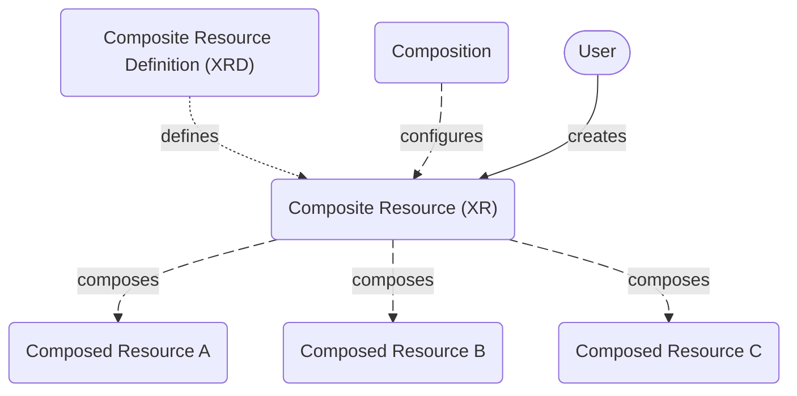

Composition lets you build custom APIs using function pipelines that create
multiple external resources as a single object. Instead of manually creating
Deployments, Services, ConfigMaps, and other resources individually, you can use
a custom API to create all the necessary resources.

## How compositions work

The composition workflow consists of three components:

- Composite Resource Definitions (`XRDs`) - define the API schema for the custom API you need to create your resources.
- Compositions - the pipeline of logic to declare how to create those resources
- Composite Resources (`XRs`) - the resources created when users request them from your custom API.

These components work together to create your resources as a single Kubernetes object for the control plane to manage.



## Operational workflow

1. Platform team defines the API

The XRD is the schema for your custom API. If your custom API interacts with
your cloud provider to create an Application deployment, your XRD can define:

- The API name (kind:App)
- Necessary fields and what fields can accept user input
- Validation and default values

Once the platform team creates the XRD, they apply it to their Crossplane
control plane.

2. Platform team implements the API 

The Composition defines what happens when someone uses your custom API. The
functions (written in a standard programming language) in the composition:

- Extract user input from the Composite Resource (XR)
- Create the actual resources
- Configure the relationships between resources

Once the platform team creates the Composition, they apply it to their
Crossplane control plane.

3. User applies the API

The Composite Resource (XR) is the request for the Composition to create the
defined resources and any user input that may be required

4. Control plane creates the resources

Crossplane constantly watches for new requests and when the user applies the XR,
Crossplane takes action:

- Crossplane finds the related Composition that matches the XR
- Executes the functions in the Composition pipeline
- Creates the generated resources

## Example

Let's work from the XR to the XRD to understand what's happening.


<Tabs>

<TabItem value="XR">

The XR below is an example of what a user would need to create an `App`. The
fields available to edit are fields that the platform team determines. In this
case, the user can choose the `namespace` of the App, the `name`, and the
`image`.

Namespacing resources is helpful to segment your infrastructure. The user can
deploy to the `default` namespace and chose an `nginx` image to deploy.

```yaml
apiVersion: example.crossplane.io/v1
kind: App
metadata:
  namespace: default
  name: my-app
spec:
  image: nginx
```
</TabItem>

<TabItem value = "Composition">

The Composition below is the logic pipeline between the XR and the XRD. This
example uses `function-python` to create the function logic and declares what to
compose based on **Observed** resources and **Desired** resources for the `kind`
the XR requests.

For more information on writing functions, see the Functions documentation.
<!--- TODO(tr0njavolta): link--->
```yaml
apiVersion: apiextensions.crossplane.io/v1
kind: Composition
metadata:
  name: app-python
spec:
  compositeTypeRef:
    apiVersion: example.crossplane.io/v1
    kind: App
  mode: Pipeline
  pipeline:
  - step: create-deployment-and-service
    functionRef:
      name: crossplane-contrib-function-python
    input:
      apiVersion: python.fn.crossplane.io/v1beta1
      kind: Script
      script: |
        def compose(req, rsp):
            observed_xr = req.observed.composite.resource

            rsp.desired.resources["deployment"].resource.update({
                "apiVersion": "apps/v1",
                "kind": "Deployment",
                "metadata": {
                  "labels": {"example.crossplane.io/app": observed_xr["metadata"]["name"]},
                },
                "spec": {
                    "replicas": 2,
                    "selector": {"matchLabels": {"example.crossplane.io/app": observed_xr["metadata"]["name"]}},
                    "template": {
                      "metadata": {
                        "labels": {"example.crossplane.io/app": observed_xr["metadata"]["name"]},
                      },
                      "spec": {
                        "containers": [{
                          "name": "app",
                          "image": observed_xr["spec"]["image"],
                          "ports": [{"containerPort": 80}]
                        }],
                      },
                    },
                },
            })

            observed_deployment = req.observed.resources["deployment"].resource
            if "status" in observed_deployment:
              if "availableReplicas" in observed_deployment["status"]:
                rsp.desired.composite.resource.get_or_create_struct("status")["replicas"] = observed_deployment["status"]["availableReplicas"]
              if "conditions" in observed_deployment["status"]:
                for condition in observed_deployment["status"]["conditions"]:
                  if condition["type"] == "Available" and condition["status"] == "True":
                    rsp.desired.resources["deployment"].ready = True

            rsp.desired.resources["service"].resource.update({
                "apiVersion": "v1",
                "kind": "Service",
                "metadata": {
                  "labels": {"example.crossplane.io/app": observed_xr["metadata"]["name"]},
                },
                "spec": {
                  "selector": {"example.crossplane.io/app": observed_xr["metadata"]["name"]},
                  "ports": [{"protocol": "TCP", "port": 8080, "targetPort": 80}],
                },
            })

            observed_service = req.observed.resources["service"].resource
            if "spec" in observed_service and "clusterIP" in observed_service["spec"]:
              rsp.desired.composite.resource.get_or_create_struct("status")["address"] = observed_service["spec"]["clusterIP"]
              rsp.desired.resources["service"].ready = True        
```
</TabItem>

<TabItem value="XRD">

Finally, the XRD below is an example of the schema that Crossplane needs for
this `kind`.

```yaml
apiVersion: apiextensions.crossplane.io/v2alpha1
kind: CompositeResourceDefinition
metadata:
  name: apps.example.crossplane.io
spec:
  scope: Namespaced
  group: example.crossplane.io
  names:
    kind: App
    plural: apps
  versions:
  - name: v1
    served: true
    referenceable: true
    schema:
     openAPIV3Schema:
       type: object
       properties:
        spec:
          type: object
          properties:
            image:
              description: The app's OCI container image.
              type: string
          required:
          - image
        status:
          type: object
          properties:
            replicas:
              description: The number of available app replicas.
              type: integer
            address:
              description: The app's IP address.
              type: string
```
</TabItem>
</Tabs>

## Next steps

The next pages in this section go into detail about each of these components.

