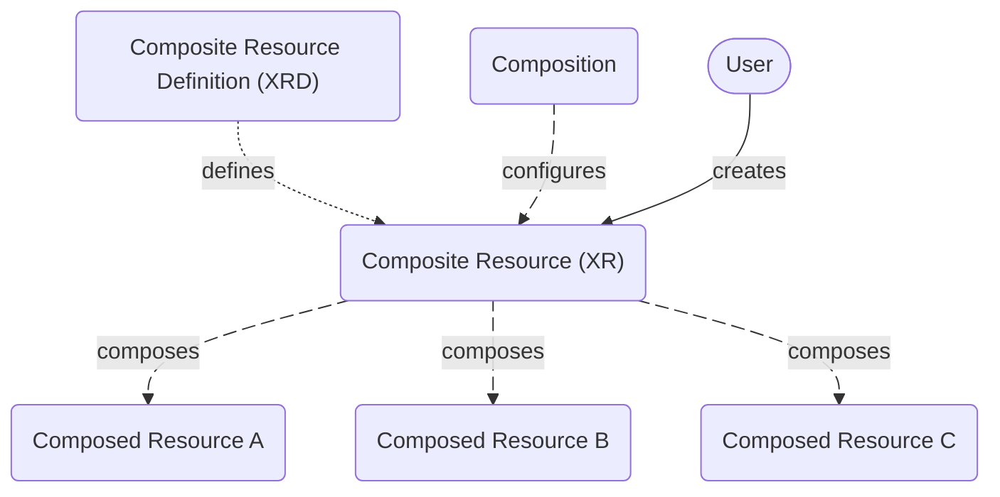

A composite resource, or XR, represents a set of Kubernetes resources as a
single Kubernetes object. Crossplane creates composite resources when users
access a custom API, defined in the CompositeResourceDefinition. 

:::tip
Composite resources are a *composite* of Kubernetes resources.  
A *Composition* defines how to *compose* the resources together.
:::

<details>
<summary>What are XRs, XRDs and Compositions?</summary>

A composite resource or XR (this page) is a custom API.

You use two Crossplane types to create a new custom API:

* A [Composite Resource Definition][xrds]
  (XRD) - Defines the XR's schema.
* A [Composition][composition] - Configures how the XR creates
  other resources.

</details>

## Create composite resources

Creating composite resources requires a 
[Composition][composition] and a 
[CompositeResourceDefinition][xrds] 
(XRD).  

The Composition defines the set of resources to create. The XRD defines the
custom API users call to request the set of resources.



XRDs define the API used to create a composite resource. For example, 
this `CompositeResourceDefinition`
creates a custom API endpoint 
`mydatabases.example.org`.

```yaml
apiVersion: apiextensions.crossplane.io/v1
kind: CompositeResourceDefinition
metadata: 
  name: mydatabases.example.org
spec:
  group: example.org
  names:
    kind: MyDatabase
    plural: mydatabases
  # Removed for brevity
```

When a user calls the custom API, 
`mydatabases.example.org`, 
Crossplane chooses the Composition to use based on the Composition's 
`compositeTypeRef`

```yaml
apiVersion: apiextensions.crossplane.io/v1
kind: Composition
metadata:
  name: my-composition
spec:
  compositeTypeRef:
    apiVersion: example.org/v1alpha1
    kind: MyDatabase
  # Removed for brevity
```

The Composition
`compositeTypeRef` matches the 
XRD `group` and 
`kind`.

Crossplane creates the resources defined in the matching Composition and
represents them as a single `composite` resource. 

```shell
kubectl get composite
NAME                    SYNCED   READY   COMPOSITION         AGE
my-composite-resource   True     True    my-composition      4s
```

### Composition selection

Select a specific Composition for a composite resource to use with 
`compositionRef`

:::tip
The selected Composition must allow the composite resource to use it with a
`compositeTypeRef`. Read more about the `compositeTypeRef` field in the
[Enable Composite Resources][composition-match]
section of the Composition documentation. 
:::

```yaml
apiVersion: example.org/v1alpha1
kind: MyDatabase
metadata:
  namespace: default
  name: my-composite-resource
spec:
  crossplane:
    compositionRef:
      name: my-other-composition
  # Removed for brevity
```

A composite resource can also select a Composition based on labels instead of 
the exact name with a
`compositionSelector`.

Inside the `matchLabels` section
provide one or more Composition labels to match.

```yaml
apiVersion: example.org/v1alpha1
kind: MyDatabase
metadata:
  namespace: default
  name: my-composite-resource
spec:
  crossplane:
    compositionSelector:
      matchLabels:
        environment: production
    # Removed for brevity
```

### Composition revision policy

Crossplane tracks changes to Compositions as 
[Composition revisions][composition-revisions]. 

A composite resource can use
a `compositionUpdatePolicy` to
manually or automatically reference newer Composition revisions.

The default 
`compositionUpdatePolicy` is 
"Automatic." Composite resources automatically use the latest Composition
revision. 

Change the policy to 
`Manual` to prevent composite
resources from automatically upgrading.

```yaml
apiVersion: example.org/v1alpha1
kind: MyDatabase
metadata:
  namespace: default
  name: my-composite-resource
spec:
  crossplane:
    compositionUpdatePolicy: Manual
    # Removed for brevity
```

### Composition revision selection

Crossplane records changes to Compositions as 
[Composition revisions][composition-revisions].    
A composite resource can
select a specific Composition revision.

Use `compositionRevisionRef` to
select a specific Composition revision by name.

For example, to select a specific Composition revision use the name of the
desired Composition revision. 

```yaml
apiVersion: example.org/v1alpha1
kind: MyDatabase
metadata:
  namespace: default
  name: my-composite-resource
spec:
  crossplane:
    compositionUpdatePolicy: Manual
    compositionRevisionRef:
      name: my-composition-b5aa1eb
    # Removed for brevity
```

:::note
Find the Composition revision name from 
`kubectl get compositionrevision`

```shell
kubectl get compositionrevision
NAME                         REVISION   XR-KIND        XR-APIVERSION            AGE
my-composition-5c976ad       1          mydatabases    example.org/v1alpha1     65m
my-composition-b5aa1eb       2          mydatabases    example.org/v1alpha1     64m
```
:::

A Composite resource can also select Composition revisions based on labels
instead of the exact name with a 
`compositionRevisionSelector`.

Inside the `matchLabels` 
section provide one or more Composition revision labels to match.

```yaml
apiVersion: example.org/v1alpha1
kind: MyDatabase
metadata:
  namespace: default
  name: my-composite-resource
spec:
  crossplane:
    compositionRevisionSelector:
      matchLabels:
        channel: dev
    # Removed for brevity
```

### Pausing composite resources

Crossplane supports pausing composite resources. A paused composite resource
doesn't check or make changes on its external resources.

To pause a composite resource apply the 
`crossplane.io/paused` annotation. 

```yaml
apiVersion: example.org/v1alpha1
kind: MyDatabase
metadata:
  namespace: default
  name: my-composite-resource
  annotations:
    crossplane.io/paused: "true"
spec:
  # Removed for brevity
```

## Verify composite resources
Use 
`kubectl get composite`
to view all the composite resources Crossplane created.

```shell
kubectl get composite
NAME                    SYNCED   READY   COMPOSITION         AGE
my-composite-resource   True     True    my-composition      4s
```

Use `kubectl get` for the specific custom API endpoint to view
only those resources.

```shell
kubectl get mydatabases
NAME                    SYNCED   READY   COMPOSITION        AGE
my-composite-resource   True     True    my-composition     12m
```

Use 
`kubectl describe composite`
to view the linked 
`Composition Ref`,
and unique resources created in the
`Resource Refs`.

```yaml
kubectl describe composite my-composite-resource
Name:         my-composite-resource
Namespace:    default
API Version:  example.org/v1alpha1
Kind:         MyDatabase
Spec:
  Composition Ref:
    Name:  my-composition
  Composition Revision Ref:
    Name:                     my-composition-cf2d3a7
  Composition Update Policy:  Automatic
  Resource Refs:
    API Version:  s3.aws.m.upbound.io/v1beta1
    Kind:         Bucket
    Name:         my-composite-resource-fmrks
    API Version:  dynamodb.aws.m.upbound.io/v1beta1
    Kind:         Table
    Name:         my-composite-resource-wnr9t
# Removed for brevity
```

### Composite resource conditions

A composite resource has two status conditions: Synced and Ready.

Crossplane sets the Synced status condition to True when it's able to
successfully reconcile the composite resource. If Crossplane can't reconcile the
composite resource it reports an error in the Synced condition.

Crossplane sets the Ready status condition to True when the composite resource's
composition function pipeline reports that all its composed resources are
ready. If a composed resource isn't ready Crossplane reports it in the
Ready condition.

## Composite resource labels

Crossplane adds labels to composed resources to show their relationship to
other Crossplane components.

Crossplane adds the 
`crossplane.io/composite` label
to all composed resources. The label matches the name of the composite.
Crossplane applies the composite label to any resource created by a composite,
creating a reference between the resource and owning composite resource. 

```shell
kubectl describe mydatabase.example.org/my-database-x9rx9
Name:         my-database2-x9rx9
Namespace:    default
Labels:       crossplane.io/composite=my-database-x9rx9
```

[xrds]: /manuals/uxp/concepts/composition/composite-resource-definitions/
[xrs]: /manuals/uxp/concepts/composition/composite-resources/
[composition]: /manuals/uxp/concepts/composition/compositions/
[composition-match]: /manuals/uxp/concepts/composition/compositions/#match-composite-resources
[composition-revisions]: /manuals/uxp/concepts/composition/composition-revisions/
[k8s]: https://kubernetes.io/docs/tasks/extend-kubernetes/custom-resources/custom-resource-definitions/
