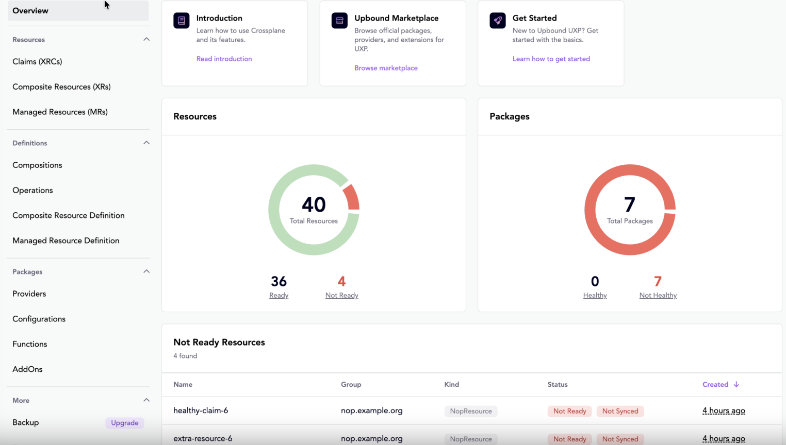
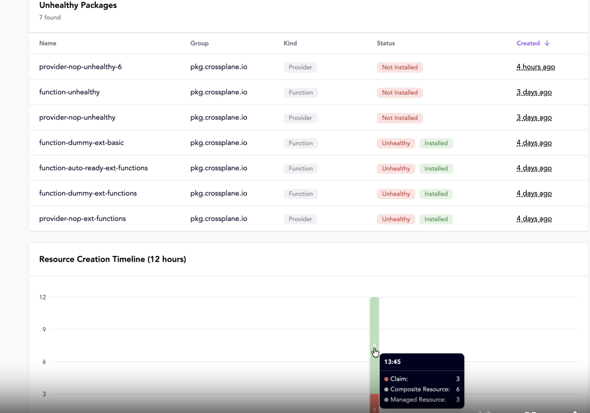
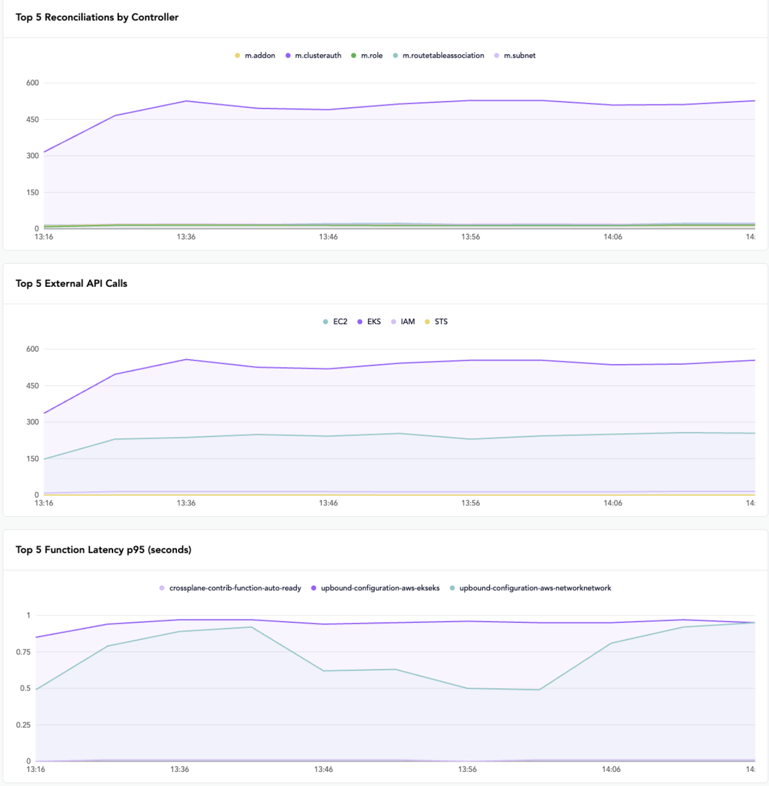

The UXP [Web UI][web-ui] includes built-in observability views that help you
quickly triage issues in your control plane. The dashboard combines resource
state with time-series metrics in one place.

:::note
Some views require a **Standard** license. Community edition users see most of
the QueryAPI-based views, with metrics charts grayed out.
:::





## Prometheus

UXP deploys a lightweight Prometheus instance for **Standard** license 
deployments to power the metrics charts. It's preconfigured with 12-hour
retention and metric filtering that keeps only what the dashboard needs.

### Bring your own Prometheus

If you already run your own Prometheus, disable the built-in instance and point
the dashboard at yours through Helm values:

```yaml
webui:
  config:
    metricsApiEndpoint: 'http://your-prometheus:9090/api/v1'
```

Your Prometheus needs to scrape UXP components and have these metrics available:

- `controller_runtime_reconcile_total`
- `upjet_resource_external_api_calls_total`
- `function_run_function_seconds_bucket`, `_sum`, `_count`

[web-ui]: /manuals/uxp/features/crossplane-web-ui
