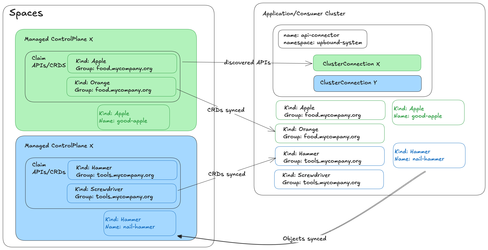

:::warning
API Connector is currently in **Alpha**. The feature is under active development and subject to breaking changes. Use for testing and evaluation purposes only.
:::

API Connector enables seamless integration between Kubernetes application clusters and remote Crossplane control planes. This component extends Crossplane capability by allowing you to connect to remote clusters and synchronize resources in an agent-based topology.

Unlike the [Control Plane Connector](ctp-connector.md) which focuses on managed control planes, API Connector provides a more flexible solution for connecting to any Crossplane-enabled cluster. But for now it's only supported for managed control planes.

## Architecture overview



API Connector uses a **provider-consumer** model:

- **Provider control plane**: The remote cluster running Crossplane that provides resources and manages infrastructure. In this case it's a managed control plane - Space.
- **Consumer cluster**: Your local Kubernetes cluster that connects to the provider and synchronizes resources.

### Key components

**Custom Resource Definitions (CRDs)**:
- `ClusterConnection`: Establishes connection to a remote cluster.
- `ClusterAPIBinding`: Binds APIs cluster-wide across namespaces.  
- `APIBinding`: Binds APIs for specific namespaces.

**Controllers**:
- Connection management for multiple cluster topologies
- Dynamic resource synchronization
- CRD discovery and management

## Prerequisites

Before using API Connector, ensure:

1. **Provider control plane** has Crossplane installed and configured
2. **Consumer cluster** has network access to the provider control plane
3. Valid authentication credentials for the provider control plane
4. CRDs in the provider control plane have the label `connect.upbound.io/bindable=true`

## Installation

### Using the up CLI (Recommended)

The up CLI provides the simplest installation method with automatic configuration:

```bash
up controlplane api-connector install <organization-name/space-name/group/control-plane-name> [OPTIONS]
```

Command creates Robot account, named `<control-plane-name>`,
token associated with the account and stores it in the `upbound-system` namespace
in the **Consumer cluster**. It also creates a `ClusterConnection` resource
in the **Consumer cluster** to connect to the **Provider control plane**.

**Example**:
```bash
up controlplane api-connector install \
  my-org/upbound-gcp-us-west-1/default/my-control-plane \
  --target-kubeconfig ~/.kube/config \
  --upbound-token <your-token>
```

Command uses provided token to authenticate with the **Provider control plane**
and create a `ClusterConnection` resource in the **Consumer cluster** to connect to the
**Provider control plane**. 

**Key Options**:
- `--target-kubeconfig`: Path to consumer cluster kubeconfig (required)
- `--name`: Custom name for connection resources (optional)
- `--upbound-token`: API token for authentication (optional)
- `--upgrade`: Upgrade existing installation (optional)
- `--version`: Specific version to install (optional)

### Using Helm

For manual installation or custom configurations:

```bash
helm upgrade --install api-connector oci://xpkg.upbound.io/spaces-artifacts/api-connector \
  --namespace upbound-system \
  --create-namespace \
  --version <version> \
  --set consumerClusterDisplayName=<cluster-name>
```

## Configuration

### Authentication Methods

API Connector supports multiple authentication methods:

#### Upbound Robot Token

For Upbound Spaces integration:

```yaml
apiVersion: v1
kind: Secret
metadata:
  name: spaces-secret
  namespace: upbound-system
type: Opaque
stringData:
  token: <robot-token>
  organization: <organization-name>
  spacesBaseURL: <spaces-base-url>
  controlPlaneGroupName: <control-plane-group-name>
  controlPlaneName: <control-plane-name>
```

#### Kubeconfig

For direct cluster access:

```yaml
apiVersion: v1
kind: Secret
metadata:
  name: provider-kubeconfig
  namespace: upbound-system
type: Opaque
data:
  kubeconfig: <base64-encoded-kubeconfig>
```

### Connection Setup

Create a `ClusterConnection` to establish connectivity:

<Tabs>
<TabItem value="upbound-token" label="Upbound Token">

```yaml
apiVersion: connect.upbound.io/v1alpha1
kind: ClusterConnection
metadata:
  name: spaces-connection
  namespace: upbound-system
spec:
  secretRef:
    kind: UpboundRobotToken
    name: spaces-secret
    namespace: upbound-system
  crdManagement:
    pullBehavior: Pull
```

</TabItem>
<TabItem value="kubeconfig" label="Kubeconfig">

```yaml
apiVersion: connect.upbound.io/v1alpha1
kind: ClusterConnection
metadata:
  name: provider-connection
  namespace: upbound-system
spec:
  secretRef:
    kind: KubeConfig
    name: provider-kubeconfig
    namespace: upbound-system
  crdManagement:
    pullBehavior: Pull
```

</TabItem>
</Tabs>

### API Binding

Bind APIs to make them available in your consumer cluster:

```yaml
apiVersion: connect.upbound.io/v1alpha1
kind: ClusterAPIBinding
metadata:
  name: <api-group-name>
  namespace: upbound-system
spec:
  connectionRef:
    kind: ClusterConnection
    name: spaces-connection
```

The `ClusterAPIBinding` name must match the **Group** name of the CRD you want to bind.

## Usage Example

After configuration, you can create resources that will be synchronized to the provider cluster:

```yaml
apiVersion: nop.example.org/v1alpha1
kind: NopResource
metadata:
  name: my-resource
  namespace: default
spec:
  coolField: "Synchronized resource"
  compositeDeletePolicy: Foreground
```

Verify the resource status:

```bash
kubectl get nopresource my-resource -o yaml
```

## Monitoring and Troubleshooting

### Check Connection Status

```bash
kubectl get clusterconnection
```

Expected output:
```
NAME                 STATUS   MESSAGE
spaces-connection    Ready    Provider controlplane is available
```

### View Available APIs

```bash
kubectl get clusterconnection spaces-connection -o jsonpath='{.status.offeredAPIs[*].name}'
```

### Check API Binding Status

```bash
kubectl get clusterapibinding
```

### Debug Resource Synchronization

```bash
kubectl describe <resource-type> <resource-name>
```

## Uninstallation

### Using the up CLI

```bash
up controlplane api-connector uninstall \
  --target-kubeconfig ~/.kube/config \
  --all
```

The `--all` flag removes all resources including connections and secrets.
Without the flag, only runtime related resources will be removed.

**Note**: Uninstall won't remove any objects in the Upbound Space API layer.

### Using Helm

```bash
helm uninstall api-connector -n upbound-system
```

## Limitations

- **Alpha maturity**: Subject to breaking changes.
- **CRD updates**: CRDs are pulled once but not automatically updated.
- **Network requirements**: Consumer cluster must have direct network access to provider cluster.
- **Connector pooling**: API Connector for now uses pooling mechanism to connect 
  to the provider control plane and update the claims

## Advanced Configuration

### Label-based CRD Discovery

CRDs must be labeled for discovery:

```bash
kubectl label crd <crd-name> connect.upbound.io/bindable=true
```

### Multiple Cluster Connections

You can connect to multiple provider clusters simultaneously by creating multiple `ClusterConnection` resources with different names and configurations.