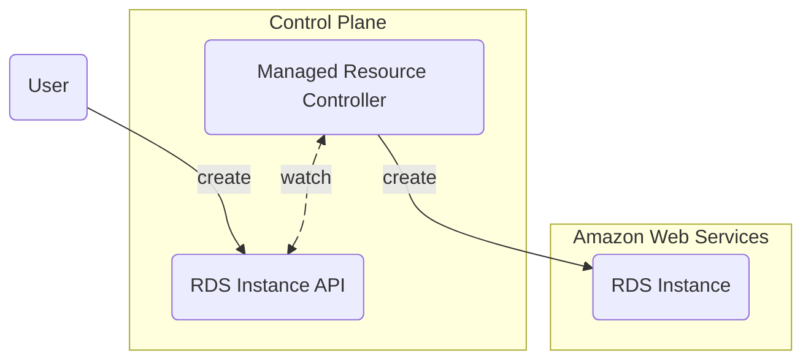

This document is a conceptual overview of Upbound's core components.

## Components

Upbound's core control plane functionality is built on three components:

* [Composition](#composition)
* [Managed resources](#managed-resources)
* [Package manager](#package-manager)

### Composition

Composition lets you build custom APIs to control your cloud native software.

Crossplane extends Kubernetes. You build your custom APIs by using Crossplane to
extend Kubernetes with new custom resources.

**To extend Kubernetes without using Crossplane you need a Kubernetes
controller.** The controller is the software that reacts when a user calls the
custom resource API.

Say you want your control plane to serve an `App` custom resource API. When
someone creates an `App`, the control plane should create a Kubernetes
`Deployment` and a `Service`.

With Crossplane you configure a pipeline of functions. The functions return
declarative configuration that Crossplane should apply.

With Composition, you can focus on expressing your business logic in your
preferred language.

Composition functions are like configuration language plugins.

Functions allow you to write your configuration in several languages, including
[YAML](https://yaml.org), [KCL](https://www.kcl-lang.io),
[Python](https://python.org), and [Go](https://go.dev).

You can use composition together with [managed resources](#managed-resources) to
build new custom resource APIs powered by managed resources.

### Managed resources

Managed resources (MRs) are ready-made Kubernetes custom resources. 

Each MR extends Kubernetes with the ability to manage a new system. For example
there's an RDS instance MR that extends Kubernetes with the ability to manage
[AWS RDS](https://aws.amazon.com/rds/) instances.

Crossplane has an extensive library of managed resources you can use to manage
almost any cloud provider, or cloud native software.

**With Crossplane you don't need build custom integrations to manage external
services.** There's already a Crossplane managed resource for that.

You can use managed resources together with [composition](#composition) to build
new custom resource APIs powered by MRs.

### Package manager

The Crossplane package manager lets you install new managed resources and
composition functions.

You can also package any part of a control plane's configuration and install it
using the package manager. This allows you to deploy several control planes with
identical capabilities - for example one control plane per region or per
service.

Read about Crossplane [packages](/crossplane/packages)
to learn about the package manager.

## Next steps

Now that you know the parts of a control plane, you can build your first control
plane.
Follow [Get Started with Managed Resources](/crossplane/get-started/get-started-with-managed-resources)
to see how managed resources work.

